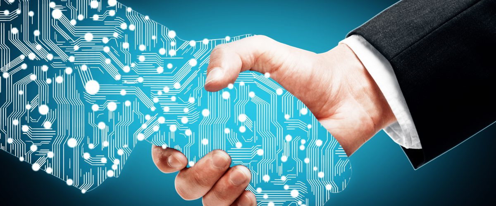

# Transformación Digital

## Reto

Un banco tradicional Peruano quiere hacer una transformación digital y contrata el servicio de estudiantes de Laboratia para hacer esto posible. Los puntos principales a verificar son los siguientes:

- Hacer una reunión _kick-off_ con los Stakeholders con el plan de investigación
- Decidir quienes son los _Stakeholders_
- Tipos de preguntas que se realizarían en esta primera reunión
- Realizar el __Canvas de modelo de negocio__

## ¿En que nos hemos basado para nuestra investigación?  
  
Hemos tomado como referencia __aplicaciones internacionales__ como: *Nequi* y *Simple* que son dirigidos netamente hacía los ___Millenials___ dado que tienen más conocimiento del uso de dispositivos tecnologicos y la meta en común es dejar las agencias bancarias e intercambiarlas por transacciones digitales; Ademas, ambas desean que los procedimientos bancarios sean faciles y didácticos de entender para nuestra generación.

__Basandonos en el público peruano__ hemos tomado como referencia los bancos __BCP__ y __BBVA__ dado que su meta principal es transformar lo tradicional a lo digital; Ademas, para llegar a ello realizan reuniones con las areas necesarias, sin importar los puestos o cargos, para incluir todo tipo de ideas de innovación posible.

## Brainstorming

Al hacer lecturas e investigaciónes sobre los bancos más influyentes de nuestro país junto con innovaciones digitales internacionales, hemos hecho una lluvia de ideas [aquí](https://realtimeboard.com/app/board/o9J_kzq3ekQ=/) !. 

## Presentación

En esta [Presentación powerpoint](https://1drv.ms/p/s!Ajr-tUTQOX2ufdYRHz_5jvHshHA) vamos a aclarar los puntos cuestionados en la explicación del reto. 

